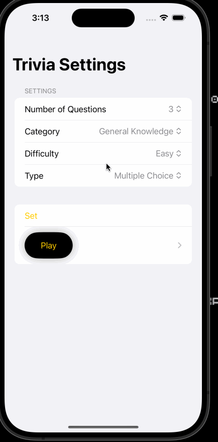

# Project 5 - *Trivia App*

Submitted by: **Nelson Wang**

**Trivia Game** is an app that ... [TODO] 

Time spent: **20** hours spent in total

## Required Features

The following **required** functionality is completed:

- [x] App launches to an Options screen where user can modify the types of questions presented when the game starts. Users should be able to choose:
  - [x] Number of questions
  - [x] Category of questions
  - [x] Difficulty of questions
  - [x] Type of questions (Multiple Choice or True False)
- [x] User can tap a button to start trivia game, this presents questions and answers in a List or Card view.
  - Hint: For Card view visit your FlashCard app. List view is an equivalent to UITableView in UIKit. Much easier to use!
- [x] Selected choices are marked as user taps their choice (but answered is not presented yet!)
- [x] User can submit choices and is presented with a score on trivia game
 
The following **optional** features are implemented:

- [x] User has answer marked as correct or incorrect after submitting choices (alongside their score).
- [ ] Implement a timer that puts pressure on the user! Choose any time that works and auto submit choices after the timer expires. 

The following **additional** features are implemented:

- [x] List anything else that you can get done to improve the app functionality!

## Video Walkthrough

Here's a walkthrough of implemented user stories:

Here is a reminder on how to embed Loom videos on GitHub. Feel free to remove this reminder once you upload your README. 

## Group Project Submission

## Nelson

### Digital Planner/Minimalistic Journal/Task Tracking App
- Either a tracker for planning
- Plan and schedule tasks/assigments
- Track time, have a pomodoro to track productivity and time stpet

### Expense Tracking App
- Tracks expenses locally, fast
- Exports to csv/api/etc
- Has visualizations.

### Focusmate / Time Blocking App. (Helps you match study sessions)
- Matches you with another student/study mate for a session of 30 minutes of study.
- Time block, organize and scheudle sessions.

## Hevander

- Youtube Clone
- Expenses tracking app
- Music player

# Abraham
### Tutor Matching App
    1. Lets you choose category/subject you need help with
    2. Matches you with a tutor for help
### AI Recipe Maker
    1. Lets you take photo of yout fridge
    2. Scans your fridge for indgridients and shows a random recipe
### Random Snapchat
    1. You have to take a snap and upload it everyday
    2. The snap is randomly sent to a person and the person has to 
    respond (similar to omegle but with snaps)

Md Shahedur Rahman
- Grocery Delivery App
- Voice Translation App
- Weather Alert App
- Virtual Shopping App

Kevin
- Task Countdown App
- Schedule/Time Block App
- Outfit Generator App

## Notes

Describe any challenges encountered while building the app.

## License

    Copyright [yyyy] [name of copyright owner]

    Licensed under the Apache License, Version 2.0 (the "License");
    you may not use this file except in compliance with the License.
    You may obtain a copy of the License at

        http://www.apache.org/licenses/LICENSE-2.0

    Unless required by applicable law or agreed to in writing, software
    distributed under the License is distributed on an "AS IS" BASIS,
    WITHOUT WARRANTIES OR CONDITIONS OF ANY KIND, either express or implied.
    See the License for the specific language governing permissions and
    limitations under the License.

